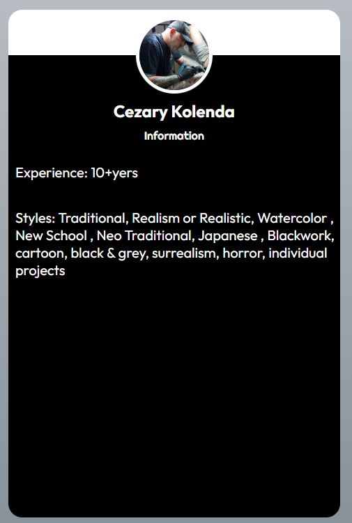
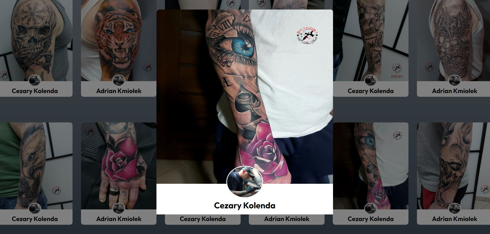
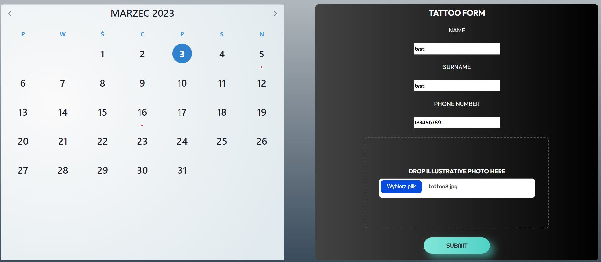
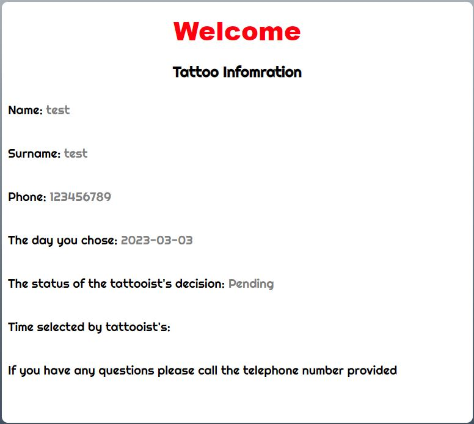
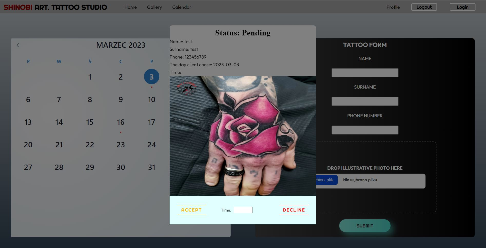
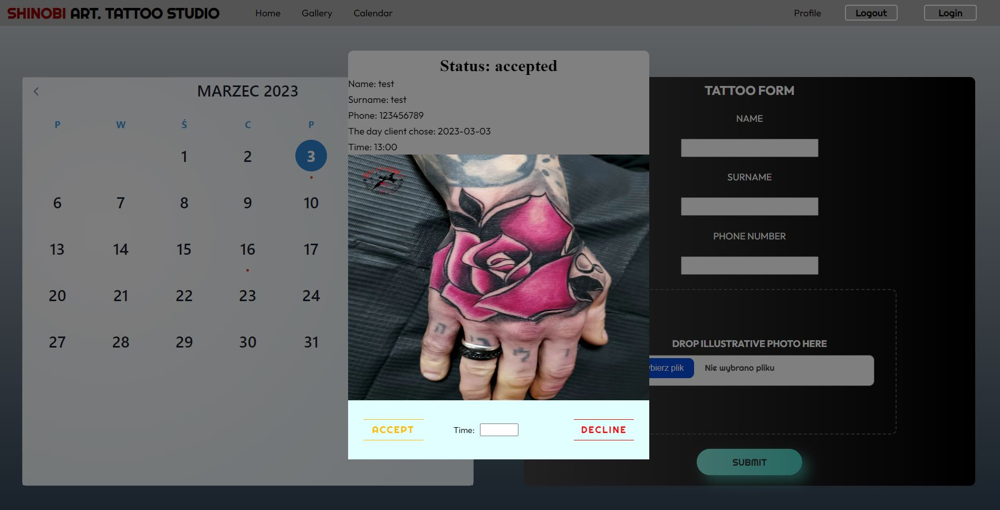
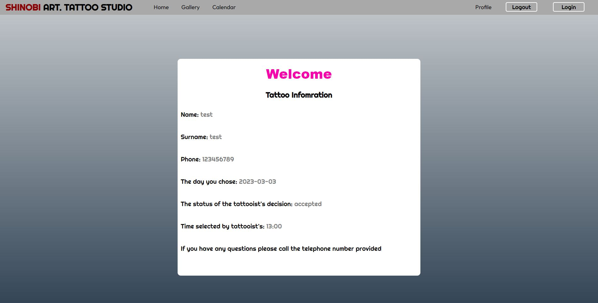
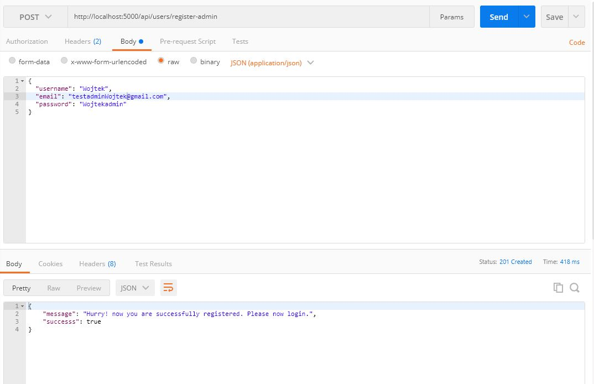
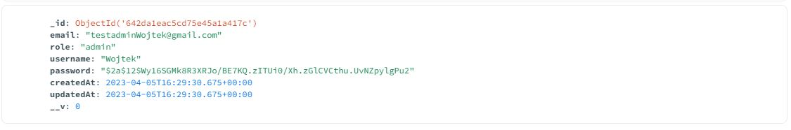

# Shinobi-tattoo
Shinobi-art-studio is a self-designed and programmed website to provide information about tattoo artist and their arts.


# Project Description
The project consists on three main parts.

The first one is responsible for providing basic information about the studio:

* Experience,styles and example arts made in the studio.
* Look at the rules of the studio.
* Were customer can find the studio.
* Makes life easier for a customers to choose correct place for them.

The secound part of the project is responsible for:

* authorization and authentication customers and tattoo artists. 
* Create a account and login into the website by a customer.
* Check and make the reservation at the day they are intrested in by provading basic required informations.
* Look into the profile card to see status of our reservation.


Last part of the project is obligeded to deliver informations to the customer by admin(tatto artist)
* Check in the calendar which dates was choosen by a customers(red dots) and look at the project sended by customer.
* Accept or deciline project sended by customer.
* Set the time for getting a tattoo.

The application uses technologies such as:
* Vue.js
* Express
* Node.js
* MongoDB
* CSS(SCSS)
* Javasciprt
* RWD

Thanks to this project, I developed my skills in the Vue.js and SasS by building frontend of the website.
Also I acquired skills in programming backend in javascript needed to authorization and authentication
users and admins.I gained experience in connections between backend and frontend of the website.
What's more i developed my skills in connecting database and the website to provide informations.
Now i am familiar with methods like POST or GET.

## Screenshots

Basic Informations and gallery






Login and Register Customer


Tattoo Form Customer



Profile before state



Tattoo artist modal before set state



Tattoo artist modal with chosen state



Profile card with chosen state and time




### Project setup
1 . If there is lack of .env create a .env file. an examples of finished file is 

APP_DB = mongodb://127.0.0.1:27017/node-auth

APP_SECRET = qwertyuiop

APP_PORT = 5000

2.Run the following command to start the website:

```
npm run serve
```
3.The application will be available at http://localhost:8080/


4.Run the following command in the new terminal to start the backend:

```
node index.js
```

5. Download mongoDB compass to see results in the database


6. To get acess to the tattoo artists permission u have to download https://www.postman.com/ and create account in the POSTMAN how to make it screen below.







